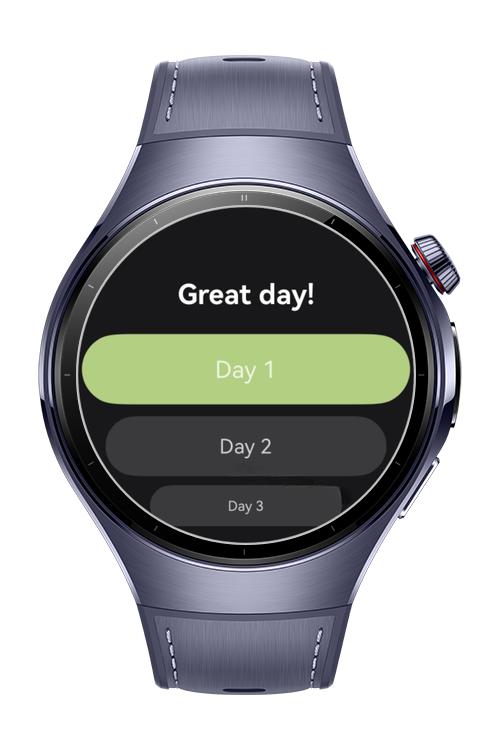

> **Note:** To access all shared projects, get information about environment setup, and view other guides, please visit [Explore-In-HMOS-Wearable Index](https://github.com/Explore-In-HMOS-Wearable/hmos-index).

# Smart Word
Smart Word is a minimalist daily vocabulary suggestion app built with ArkTS and ArkUI, optimized for HarmonyOS smartwatches and smart devices. It delivers five new words every day through interactive and actionable notifications, helping users expand their vocabulary effortlessly.

---

# Preview

<div>




</div>

---

# Use Cases

1. Daily Word Suggestion : Every day, the app automatically delivers five curated vocabulary words to the user.
2. Launch App from Actionable Notification: Tapping the actionable notification instantly opens the app and displays the daily vocabulary list.
3. Swipe Through Word Cards: Users can smoothly swipe through individual word cards using ArcSwiper for a focused learning experience.
4. View All Words in List Format: Users can view all five daily words in a scrollable ArcList for quick browsing and comparison.
5. Detect Day Change and Refresh Words: The app detects a new day and automatically generates a fresh word list while updating stored data.
6. Persistent Word Storage: All word data is saved locally to ensure continuity and offline access across app sessions.
7. Send Passive Notification: A passive daily notification reminds users to check the app for new vocabulary without requiring interaction.

---

# Tech Stack

- Languages: ArkTS (Ark TypeScript)

- Frameworks: HarmonyOS SDK 5.1.0 (API Version 18)

- Tools: DevEco Studio Version 5.1.0.842

- Libraries & Kits:
 	- @kit.NotificationKit	Used for creating and managing both actionable and passive notifications.
	- @kit.AbilityKit	Enables app launch logic and intent routing via WantAgent.
	- @kit.BasicServicesKit	Provides BusinessError for handling exceptions and service errors.
	- @kit.PerformanceAnalysisKit	Utilized for logging and debugging via hilog.
    
 ---

# Directory Structure
```
|---model
|   |---DayModel.ets           # Represents day change and date tracking
|   |---StorageManager.ets     # Handles persistent data storage
|   |---VocabModel.ets         # Data model for vocabulary words

|---pages
|   |---HomePage.ets           # Main screen displaying the daily words
|   |---Index.ets              # Entry point for routing and init logic
|   |---WordsPage.ets          # Page listing all daily words in detail

|---service
|   |---NotificationService.ets # Sends and manages notifications

|---utils
|   |---Constants.ets           # Application constants and config values
|   |---RouterUtil.ets          # Helper methods for navigation between pages

|---viewmodel
|   |---MainViewModel.ets       # State management and business logic for the main screen

```

---

# Constraints and Restrictions

## Supported Devices

- Huawei Watch 5
- Devices running HarmonyOS 5.1.0 (API 18) and above

---


# LICENSE

SmartWord is distributed under the terms of the MIT License
See the [LICENSE](./LICENSE) for more information.
